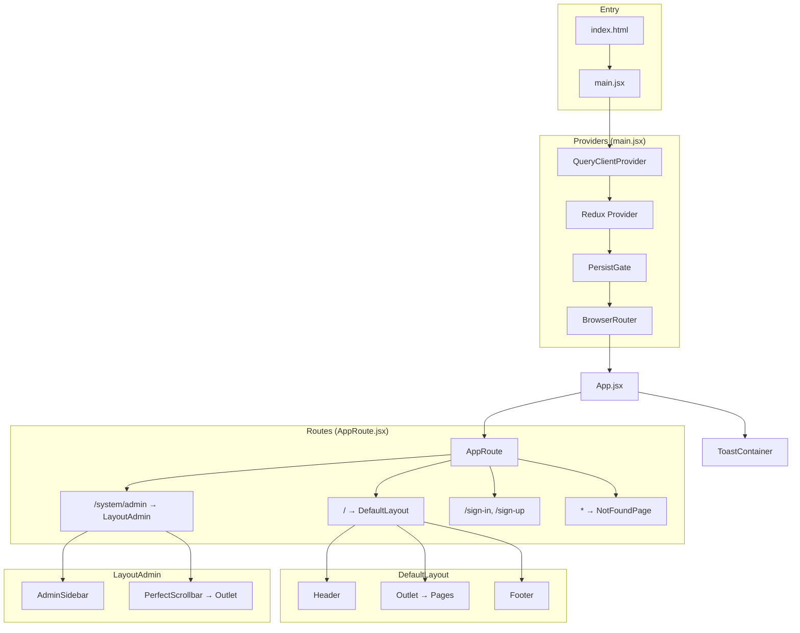
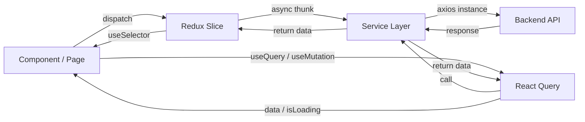
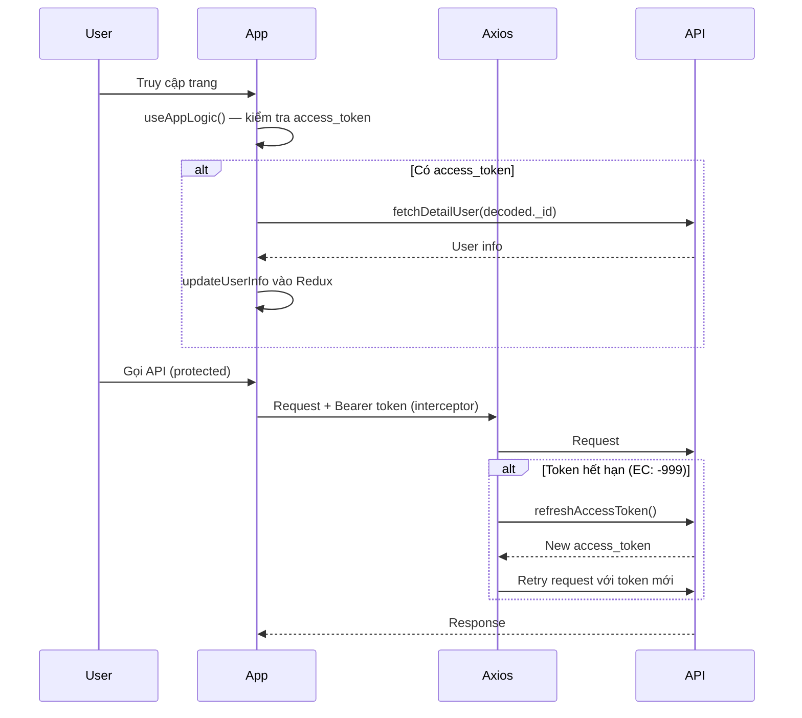
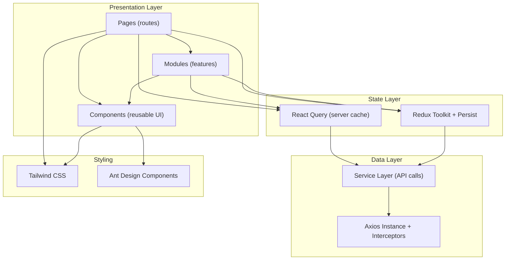

# 📋 Tổng Quan Cấu Trúc Project — Quản Lý Phòng Khám Thú Cưng (Front-End)

> **Dựa trên:** MobileStore-FE-master (React + Vite)
> **Chủ đề:** Hệ thống quản lý phòng khám chữa bệnh thú cưng (Pet Clinic)
> **Thay đổi chính:** Sử dụng **Tailwind CSS** thay cho `styled-components`. Loại bỏ Facebook, Paypal. Thay module **Order** → **Appointment** (Lịch hẹn khám). Thay **Cart** → **Booking** (Đặt lịch). Thay **Product** → **Service** (Dịch vụ khám). Thêm module **Pet** (Thú cưng).
> **Loại bỏ thư viện:** `html2canvas`, `jspdf`, `react-paypal-button-v2`, `styled-components`, `xlsx`

---

## 1. Công Nghệ & Thư Viện Sử Dụng

| Thư viện | Version | Mô tả |
|---|---|---|
| `react` | ^18.3.1 | Thư viện UI chính |
| `react-dom` | ^18.3.1 | Render React lên DOM |
| `react-router-dom` | ^6.26.2 | Routing (điều hướng trang) |
| `@reduxjs/toolkit` | ^2.3.0 | State management (Redux Toolkit) |
| `react-redux` | ^9.1.2 | Kết nối React với Redux |
| `redux-persist` | ^6.0.0 | Lưu trữ Redux state vào localStorage |
| `@tanstack/react-query` | ^5.61.0 | Server state management, caching API |
| `@tanstack/react-query-devtools` | ^5.61.0 | DevTools cho React Query |
| `axios` | ^1.7.7 | HTTP client gọi API |
| `antd` | ^5.22.1 | UI component library (Table, Modal, Form, Image...) |
| `tailwindcss` | (mới) | **Thay thế styled-components** — Utility-first CSS framework |
| `react-toastify` | ^10.0.6 | Thông báo toast |
| `sweetalert2` | ^11.14.5 | Popup xác nhận (confirm, alert) |
| `recharts` | ^2.14.1 | Biểu đồ (PieChart cho Dashboard Admin) |
| `react-slick` | ^0.30.2 | Slider/Carousel component |
| `slick-carousel` | ^1.8.1 | CSS cho react-slick |
| `react-perfect-scrollbar` | ^1.5.8 | Custom scrollbar (dùng trong Admin) |
| `react-error-boundary` | ^4.1.2 | Bắt lỗi React component |
| `jwt-decode` | ^4.0.0 | Decode JWT token |
| `lodash` | ^4.17.21 | Utility functions |
| `nprogress` | ^0.2.0 | Progress bar khi gọi API |
| `date-fns` | ^4.1.0 | Xử lý ngày tháng |
| `dotenv` | ^16.4.5 | Biến môi trường |

### Dev Dependencies

| Thư viện | Mô tả |
|---|---|
| `vite` ^5.4.10 | Build tool |
| `@vitejs/plugin-react-swc` | Vite plugin dùng SWC compiler cho React |
| `eslint` + plugins | Linting code |

---

## 2. Biến Môi Trường (`.env`)

```env
VITE_PORT=               # Port chạy dev server (mặc định 3000)
VITE_BACKEND_URL=        # URL của Backend API
VITE_APP_IS_LOCAL=       # Cờ môi trường local
```

> [!NOTE]
> Đã loại bỏ `VITE_APP_FB_ID` (Facebook App ID) so với project gốc.

---

## 3. Mapping Chuyển Đổi Module (MobileStore → Pet Clinic)

| MobileStore (gốc) | Pet Clinic (mới) | Giải thích |
|---|---|---|
| **Product** (Sản phẩm) | **Service** (Dịch vụ khám) | Các dịch vụ: khám tổng quát, tiêm phòng, phẫu thuật, tẩy giun, grooming... |
| **Cart** (Giỏ hàng) | **Booking** (Đặt lịch khám) | Chọn dịch vụ + thú cưng → đặt lịch hẹn |
| **Order** (Đơn hàng) | **Appointment** (Lịch hẹn khám) | Lịch hẹn khám bệnh cho thú cưng |
| **Payment** (Thanh toán) | **Payment** (Thanh toán) | Thanh toán phí khám/dịch vụ (giữ nguyên, bỏ PayPal) |
| *(không có)* | **Pet** (Thú cưng) | **[MỚI]** Quản lý thông tin thú cưng của khách hàng |

---

## 4. Cây Thư Mục Tổng Quan

```
project-root/
├── index.html                  # Entry HTML (mount #root)
├── vite.config.js              # Cấu hình Vite
├── tailwind.config.js          # [MỚI] Cấu hình Tailwind CSS
├── postcss.config.js           # [MỚI] PostCSS config cho Tailwind
├── package.json
├── .env.example
├── .gitignore
│
├── public/                     # Static assets
│
└── src/
    ├── main.jsx                # Entry point — Providers wrapper
    ├── index.css               # [MỚI] Tailwind directives
    │
    ├── assets/
    │   └── images/             # Logo, banner phòng khám...
    │
    ├── views/
    │   ├── App.jsx             # Component gốc — AppRoute + ToastContainer
    │   └── App.css
    │
    ├── routes/
    │   ├── AppRoute.jsx        # Cấu hình routes (lazy loading)
    │   └── PrivateRoute.jsx    # Guard route — kiểm tra đăng nhập & quyền Admin
    │
    ├── layout/
    │   ├── DefaultLayout.jsx       # Layout chính: Header + Content + Footer
    │   ├── LayoutAdmin.jsx         # Layout Admin: Sidebar + Content
    │   ├── LayoutAuth.jsx          # Layout trang Login/Register
    │   ├── LayoutManageUser.jsx
    │   ├── LayoutManageService.jsx # (gốc: LayoutManageProduct)
    │   ├── LayoutManagePet.jsx     # [MỚI]
    │   └── LayoutManageAppointment.jsx  # (gốc: LayoutManageOrder)
    │
    ├── pages/
    │   ├── HomePage/
    │   │   └── HomePage.jsx        # Trang chủ — giới thiệu phòng khám, dịch vụ nổi bật
    │   ├── Login/
    │   │   └── SignInPage.jsx
    │   ├── Register/
    │   │   └── SignUpPage.jsx
    │   ├── Service/                # (gốc: Product/)
    │   │   ├── ServicePage.jsx         # Danh sách dịch vụ
    │   │   ├── ServiceDetailPage.jsx   # Chi tiết dịch vụ
    │   │   └── TypeServicePage.jsx     # Lọc dịch vụ theo loại
    │   ├── Pet/                    # [MỚI]
    │   │   └── MyPetPage.jsx           # Danh sách thú cưng của tôi
    │   ├── Booking/                # (gốc: Cart/)
    │   │   └── BookingPage.jsx         # Chọn dịch vụ + thú cưng → đặt lịch
    │   ├── Payment/
    │   │   └── PaymentPage.jsx         # Thanh toán phí dịch vụ
    │   ├── Appointment/            # (gốc: Order/)
    │   │   ├── AppointmentPage.jsx         # Layout outlet
    │   │   ├── AppointmentRecentPage.jsx   # Lịch hẹn vừa đặt
    │   │   ├── MyAppointmentPage.jsx       # Lịch sử lịch hẹn
    │   │   └── AppointmentDetailPage.jsx   # Chi tiết lịch hẹn
    │   ├── Profile/
    │   │   └── ProfilePage.jsx
    │   ├── Admin/
    │   │   ├── DashboardPage.jsx
    │   │   ├── User/
    │   │   │   └── ManageUserPage.jsx
    │   │   ├── Service/            # (gốc: Product/)
    │   │   │   └── ManageServicePage.jsx
    │   │   ├── Pet/                # [MỚI]
    │   │   │   └── ManagePetPage.jsx
    │   │   └── Appointment/        # (gốc: Order/)
    │   │       └── ManageAppointmentPage.jsx
    │   └── NotFoundPage.jsx
    │
    ├── components/             # UI Components tái sử dụng
    │   ├── Header/    → Header.jsx
    │   ├── Footer/    → Footer.jsx
    │   ├── Navbar/    → Navbar.jsx
    │   ├── Card/      → CardComponent.jsx
    │   ├── Slider/    → SliderComponent.jsx
    │   ├── Button/    → ButtonComponent.jsx, index.js
    │   ├── Input/     → InputComponent.jsx, InputForm.jsx, InputSearch.jsx, index.js
    │   ├── Modal/     → ModalComponent.jsx
    │   ├── Drawer/    → DrawerComponent.jsx
    │   ├── Table/     → TableComponent.jsx
    │   ├── Chart/     → PieChartComponent.jsx
    │   ├── Step/      → StepComponent.jsx
    │   ├── Loading/   → Loading.jsx
    │   ├── Alert/     → Alert.jsx
    │   └── Common/    → ErrorComponent.jsx
    │
    ├── modules/                # Business logic components
    │   ├── Service/            # (gốc: Product/)
    │   │   ├── DetailService.jsx
    │   │   └── TypeServices.jsx
    │   ├── Pet/                # [MỚI]
    │   │   └── PetItem.jsx
    │   ├── Appointment/        # (gốc: Order/)
    │   │   └── AppointmentItem.jsx
    │   └── Admin/
    │       ├── AdminSidebar.jsx
    │       ├── User/
    │       │   ├── UserTable.jsx
    │       │   ├── UserUpdate.jsx
    │       │   ├── UserDelete.jsx
    │       │   └── UserDeleteMany.jsx
    │       ├── Service/        # (gốc: Product/)
    │       │   ├── ServiceTable.jsx
    │       │   ├── ServiceAddNew.jsx
    │       │   ├── ServiceUpdate.jsx
    │       │   ├── ServiceDelete.jsx
    │       │   └── ServiceDeleteMany.jsx
    │       ├── Pet/            # [MỚI]
    │       │   └── PetTable.jsx
    │       └── Appointment/    # (gốc: Order/)
    │           └── AppointmentTable.jsx
    │
    ├── redux/
    │   ├── store.js            # Redux store + persist config
    │   └── slices/
    │       ├── userSlice.js        # User state (info, access_token)
    │       ├── serviceSlice.js     # (gốc: productSlice) — Service state
    │       ├── petSlice.js         # [MỚI] Pet state
    │       └── appointmentSlice.js # (gốc: orderSlice) — Appointment/Booking state
    │
    ├── services/               # API service layer
    │   ├── userService.js          # Login, Register, Logout, CRUD Users
    │   ├── serviceService.js       # (gốc: productService) — CRUD Dịch vụ khám
    │   ├── petService.js           # [MỚI] CRUD Thú cưng
    │   ├── appointmentService.js   # (gốc: orderService) — CRUD Lịch hẹn
    │   └── paymentService.js       # Cấu hình thanh toán
    │
    ├── hooks/
    │   ├── useAppLogic.jsx             # Logic khởi tạo app
    │   ├── useRefreshToken.jsx         # Refresh access token
    │   ├── useServices.jsx             # (gốc: useProducts) — Logic dịch vụ
    │   ├── useUsers.jsx                # Logic người dùng
    │   ├── usePets.jsx                 # [MỚI] Logic thú cưng
    │   ├── useAppointments.jsx         # (gốc: useOrders) — Logic lịch hẹn
    │   ├── useAppointmentHistory.jsx   # (gốc: useOrderHistory) — Lịch sử hẹn
    │   └── useAppointmentCalculate.jsx # (gốc: useOrderCalculate) — Tính phí
    │
    ├── setup/
    │   └── axios.js            # Axios instance + interceptors
    │
    ├── constants/
    │   └── appointmentConstant.js  # (gốc: orderConstant) — Trạng thái & loại lịch hẹn
    │
    └── utils/
        ├── convertPrice.js         # Format giá tiền dịch vụ
        ├── getBase64.js            # Chuyển file sang Base64 (upload ảnh thú cưng)
        ├── buildSelectOptions.js   # Tạo options cho Select
        └── refreshAccessToken.js   # Gọi API refresh token
```

> [!IMPORTANT]
> **Đã loại bỏ** so với project gốc:
> - `src/components/Plugin/` — Facebook SDK (CommentPlugin, LikePlugin)
> - `src/utils/exportFileExcel.js` — xuất Excel
> - Các file `style.js` → thay bằng Tailwind classes trực tiếp trong JSX
> - Logic khởi tạo Facebook SDK trong `App.jsx`

---

## 5. Kiến Trúc Tổng Quan



---

## 6. Hệ Thống Routing

### 6.1 Public Routes (DefaultLayout: Header + Footer)

| Path | Page | Mô tả |
|---|---|---|
| `/` | `HomePage` | Trang chủ — giới thiệu phòng khám, dịch vụ nổi bật |
| `/services` | `ServicePage` | Danh sách dịch vụ khám (Outlet) |
| `/services/detail/:serviceId` | `ServiceDetailPage` | Chi tiết dịch vụ |
| `/services/type/:serviceType` | `TypeServicePage` | Lọc dịch vụ theo loại |

### 6.2 Private Routes (Yêu cầu đăng nhập)

| Path | Page | Mô tả |
|---|---|---|
| `/my-pets` | `MyPetPage` | Danh sách thú cưng của tôi |
| `/booking` | `BookingPage` | Chọn dịch vụ + thú cưng → đặt lịch hẹn |
| `/payment` | `PaymentPage` | Thanh toán phí dịch vụ |
| `/appointment/recent` | `AppointmentRecentPage` | Lịch hẹn vừa đặt |
| `/appointment/history/:userId` | `MyAppointmentPage` | Lịch sử lịch hẹn |
| `/appointment/detail/:appointmentId` | `AppointmentDetailPage` | Chi tiết lịch hẹn |
| `/user-profile` | `ProfilePage` | Hồ sơ cá nhân |

### 6.3 Admin Routes (Yêu cầu quyền Admin)

| Path | Page | Mô tả |
|---|---|---|
| `/system/admin` | `DashboardPage` | Dashboard — thống kê lịch hẹn, doanh thu |
| `/system/admin/users` | `ManageUserPage` | Quản lý khách hàng (CRUD) |
| `/system/admin/services` | `ManageServicePage` | Quản lý dịch vụ khám (CRUD) |
| `/system/admin/pets` | `ManagePetPage` | Quản lý thú cưng |
| `/system/admin/appointments` | `ManageAppointmentPage` | Quản lý lịch hẹn khám |

### 6.4 Auth Routes

| Path | Page | Mô tả |
|---|---|---|
| `/sign-in` | `SignInPage` | Đăng nhập |
| `/sign-up` | `SignUpPage` | Đăng ký |

---

## 7. Luồng Dữ Liệu (Data Flow)



### Redux Store Structure

```
store
├── user          # { info: {}, access_token: '' }
├── service       # { listServices: [], totalServices, limit, isLoading, serviceTypes: [], searchService }
├── pet           # [MỚI] { listPets: [], isLoading }
└── appointment   # { appointmentItems: [], selectedServices: [], petInfo: {}, appointmentDate, status... }
```

> `redux-persist` lưu trữ **appointment** state vào `localStorage` (user, service, pet nằm trong blacklist).

---

## 8. Xác Thực & Phân Quyền (Auth Flow)



### PrivateRoute Guard
- Kiểm tra `user.info` trong Redux store
- Chưa đăng nhập → Alert + nút "Sign in"
- Truy cập `/system/*` mà không phải Admin → Alert "No permission"

---

## 9. Service Layer (API Endpoints)

### userService.js
| Function | Method | Endpoint | Mô tả |
|---|---|---|---|
| `postLogin` | POST | `/login` | Đăng nhập |
| `postRegister` | POST | `/register` | Đăng ký |
| `postLogout` | POST | `/logout` | Đăng xuất |
| `getAllUsers` | GET | `/users` | Danh sách users |
| `getDetailUser` | GET | `/users/:id` | Chi tiết user |
| `putUpdateUser` | PUT | `/users/update` | Cập nhật user |
| `deleteUser` | DELETE | `/users/delete` | Xóa user |
| `getRefreshToken` | GET | `/refresh-token/:token` | Làm mới token |

### serviceService.js *(gốc: productService)*
| Function | Method | Endpoint | Mô tả |
|---|---|---|---|
| `getAllServices` | GET | `/service` | Tất cả dịch vụ |
| `getServicesByCondition` | GET | `/service?page&limit&sort&filter&field` | Lọc/phân trang |
| `getDetailService` | GET | `/service/:id` | Chi tiết dịch vụ |
| `postAddNewService` | POST | `/service/create` | Thêm dịch vụ |
| `putUpdateService` | PUT | `/service/update` | Cập nhật dịch vụ |
| `deleteService` | DELETE | `/service/delete` | Xóa dịch vụ |
| `deleteManyServices` | DELETE | `/service/delete-many` | Xóa nhiều dịch vụ |
| `getAllServiceTypes` | GET | `/service/get-all-types` | Loại dịch vụ |
| `getServicesByType` | GET | `/service/get-services-by-type/:type` | Lọc theo loại |

### petService.js *[MỚI]*
| Function | Method | Endpoint | Mô tả |
|---|---|---|---|
| `getAllPets` | GET | `/pet` | Tất cả thú cưng |
| `getPetsByUserId` | GET | `/pet/get-pets-by-userId/:id` | Thú cưng theo chủ |
| `getDetailPet` | GET | `/pet/:id` | Chi tiết thú cưng |
| `postAddNewPet` | POST | `/pet/create` | Thêm thú cưng |
| `putUpdatePet` | PUT | `/pet/update` | Cập nhật thú cưng |
| `deletePet` | DELETE | `/pet/delete` | Xóa thú cưng |

### appointmentService.js *(gốc: orderService)*
| Function | Method | Endpoint | Mô tả |
|---|---|---|---|
| `getAllAppointments` | GET | `/appointment` | Tất cả lịch hẹn |
| `getAppointmentsByUserId` | GET | `/appointment/get-by-userId/:id` | Lịch hẹn theo user |
| `getDetailAppointment` | GET | `/appointment/get-detail/:appointmentId` | Chi tiết lịch hẹn |
| `postCreateAppointment` | POST | `/appointment/create` | Tạo lịch hẹn |
| `putUpdateAppointmentStatus` | PUT | `/appointment/update-status` | Cập nhật trạng thái |
| `deleteAppointment` | DELETE | `/appointment/delete/:appointmentId` | Hủy lịch hẹn |

### paymentService.js
| Function | Method | Endpoint | Mô tả |
|---|---|---|---|
| `getPaymentConfig` | GET | `/payment/config` | Cấu hình thanh toán |

---

## 10. Constants (appointmentConstant.js)

```js
export const appointmentConstant = {
    status: {
        pending: 'Chờ xác nhận',
        confirmed: 'Đã xác nhận',
        in_progress: 'Đang khám',
        completed: 'Hoàn thành',
        cancelled: 'Đã hủy'
    },
    payment: {
        cash: 'Thanh toán tiền mặt tại phòng khám',
        mobile_banking: 'Thanh toán qua ví điện tử'
    }
}
```

---

## 11. Axios Interceptors (setup/axios.js)

- **Request:** Gắn `Bearer token` + kích hoạt `NProgress`
- **Response:** Unwrap data, auto-refresh token khi `EC: -999`, redirect `/sign-in` nếu hết hạn

---

## 12. Phân Biệt `components` vs `modules` vs `pages`

| Thư mục | Vai trò | Ví dụ |
|---|---|---|
| `components/` | UI tái sử dụng, không chứa business logic | Button, Input, Modal, Table, Header, Footer |
| `modules/` | Feature components chứa business logic | DetailService, PetItem, AppointmentItem, AdminSidebar |
| `pages/` | Page-level — map 1:1 với route | HomePage, BookingPage, ManageAppointmentPage |

---

## 13. Chuyển Đổi Styled-Components → Tailwind CSS

### Trước (styled-components)
```jsx
const WrapperButton = styled.button`
    background-color: #fff;
    color: #79CCF2;
    padding: 10px 20px;
    border-radius: 5px;
`;
<WrapperButton onClick={handleClick}>Click me</WrapperButton>
```

### Sau (Tailwind CSS)
```jsx
<button
  className="bg-white text-sky-400 px-5 py-2.5 text-2xl rounded hover:bg-gray-100 transition-colors"
  onClick={handleClick}
>
  Click me
</button>
```

> [!TIP]
> - Xóa tất cả file `style.js` → dùng Tailwind classes trực tiếp trong JSX
> - Với CSS phức tạp, dùng `@apply` trong file CSS

---

## 14. Các Thành Phần Đã Loại Bỏ

| Item | Lý do |
|---|---|
| Facebook SDK, CommentPlugin, LikePlugin | Không cần Facebook integration |
| `react-paypal-button-v2`, PayPal logic | Không cần PayPal cho phòng khám |
| `styled-components` → Tailwind CSS | Thay đổi CSS framework |
| `html2canvas`, `jspdf`, `xlsx`, `sass` | Không cần xuất PDF/Excel/Screenshot |

---

## 15. Cấu Hình Tailwind CSS

```js
// tailwind.config.js
export default {
  content: ["./index.html", "./src/**/*.{js,ts,jsx,tsx}"],
  theme: { extend: {} },
  plugins: [],
}

// postcss.config.js
export default {
  plugins: { tailwindcss: {}, autoprefixer: {} },
}

// src/index.css
@tailwind base;
@tailwind components;
@tailwind utilities;
```

---

## 16. Tóm Tắt Kiến Trúc


